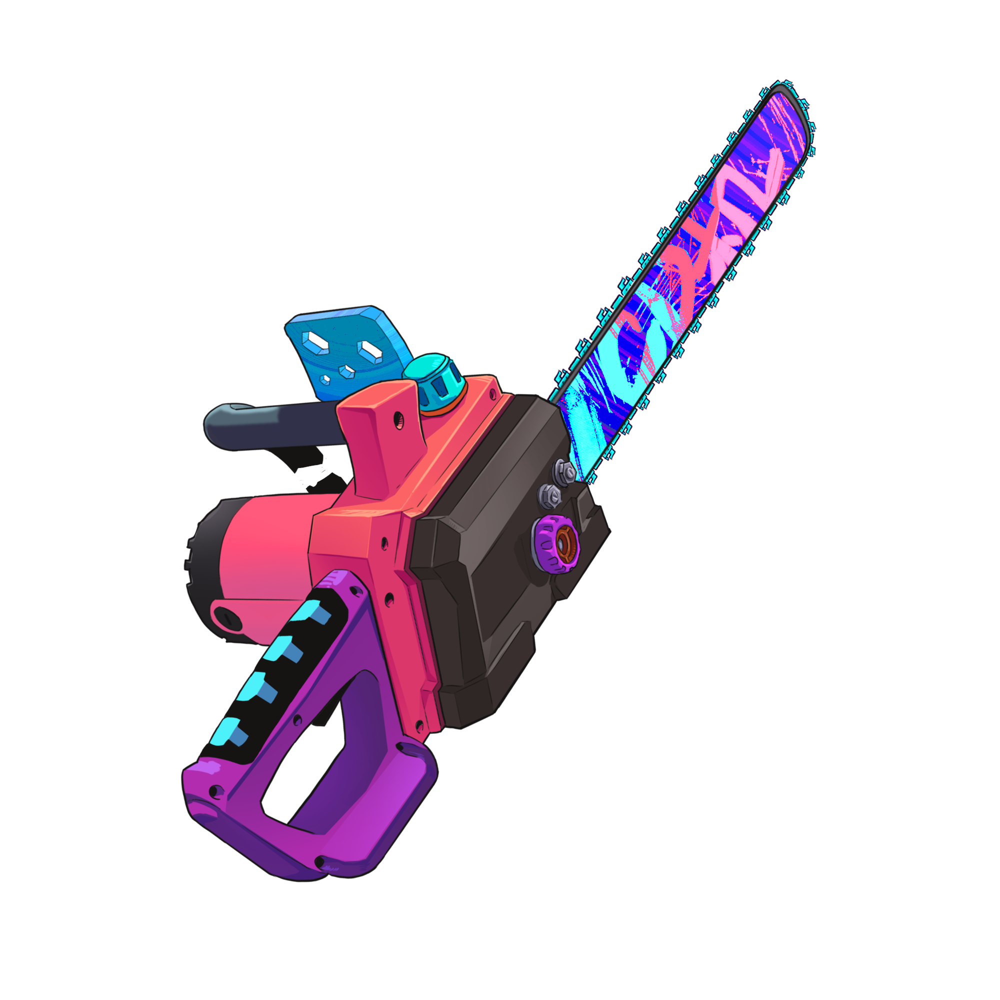

I actively participate in game jams, creating fun games in a weekend.

I am graduated in Web Developer (Technical Course)

I'm also an INTJ (if that matters to you).

I'm currently learning French.

I work in Freelance’s

##

| Github Commits | Github Details |
| ------------- | ------------- |
|  |  

| Profile details card |
| ------------- |
|   |

##

  
  
   
  
  
  
  
  
  
    
  
  
  
  
  
  

##

Publishing academic works on [Academia.edu](https://independent.academia.edu/luanvitordev)

obs: sem commits hoje, dia de estudar para prova (concurso publico)

